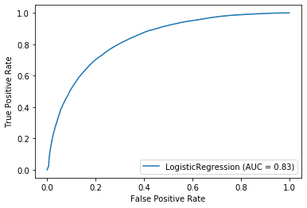

# Text Semantic Similarity
 
This is the repository for the code that ran the experiments presented in the following article: [Introduction to Deep Similarity Learning for Sequences](https://medium.com/@dimartinot/introduction-to-deep-similarity-learning-for-sequences-89d9c26f8392)

## File Exploration

The most important files are:

 - EDA.ipynb Exploratory Data Analysis notebook: used to clean and analyse the dataset. Generates the pickled version of the dataset with pre-computed sentence embeddings
 - Training.ipynb Main training pipeline: loads pickled dataset generated using the EDA.ipynb notebook
 - contrastiveModel.py : Models are kept in a single file for the moment as they share loads of similarities.
 
## Installation
I advise the use of Anaconda distribution to run the code of this project. An anaconda environment file has been generated and can be used to create a new working environment using the following command:
```
conda env create -f environment.yml
```

## Dataset generation
To generate the dataset, retrieved the source in [kaggle](https://www.kaggle.com/c/quora-question-pairs) and then import it and run the commands shown in `notebook/EDA.ipynb` to save a pickled dataset file (approx. 3GB of size).

## Execution
To execute the main code of this project, you can either run:
```shell
cd notebook
jupyter notebook
```
and then run the Training.ipynb model. 

Or you could just run:
```shell
python main.py
```

## Results
The training result of my initial ```TextSimilarityDeepSiameseLSTM``` class with a LogReg classifier are the following:

> Train Acc: 0.7993654994990785 - Val Acc: 0.7652195423623995 - Test Acc: 0.7669758812615955


